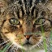
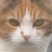
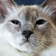
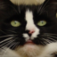

# Cats-GAN

This repo is intended to be used as both a general framework for producing simple, synthetic images using WGAN and an example application of generating cat faces (WGAN).

## Models

The GAN in this repo has two separate models, a discriminator and a generator.

The generator $G$ will take a random vector $Z$ and produce a fake image $x'$. If the generator is successful, the fake image $x'$ will approximate the distribution of real images $x$. If the discriminator $D$ is successful, then it will be able to distinguish between real images and fake images. The competing interests of the models will mean that over time, the Generator will produce images $x'$ that have the distribution as the real images $x$, so they will look like cats (see gif above).

$$
\begin{aligned}
z_i&\sim U(0, 1)\\
G(Z)&=x',~x'\sim x\text{ (if Generator is succeeding)} \\
D(x')&=0\text{ (if Discriminator is succeeding)} \\
D(x)&=1\text{ (if Discriminator is succeeding)}
\end{aligned}
$$

## Loss Functions

The WGAN has a loss function for both the generator and the discriminator:

$$
\begin{aligned}
\text{Loss}_G&=-\frac{1}{m}\sum_{i=1}^{M}{D(x_m')}\\
a&=c
\end{aligned}
$$

The main idea is that the generator should minimize the discriminator's scores of fake images. The discriminator should maximize this score, while minimzing the scores of the real images. 

## Cat Data

The cat face data used in this project are obtained from 5 different public datasets, organized in fferlito's [Cat-faces-dataset github repo](https://github.com/fferlito/Cat-faces-dataset). 

## Usage

To train a new model, replicate the `main` function in `src/main.py`.  
You should call `get_data_loaders(data_dir, batch_size, val_batch_size)` (from `src/utils/data_loader.py`), where `data_dir` is the path to your `.png` files that you want to train the GAN on. This method will return a train and validation dataloader. You also will need a `Generator` and `Discriminator` (both written in `src/models`). The `GanTrainer` class is from `src/training.py`, and will need the data_loaders and models. Other information is optional. The `train` method will train the gan and save the models at every 100th training step. 
